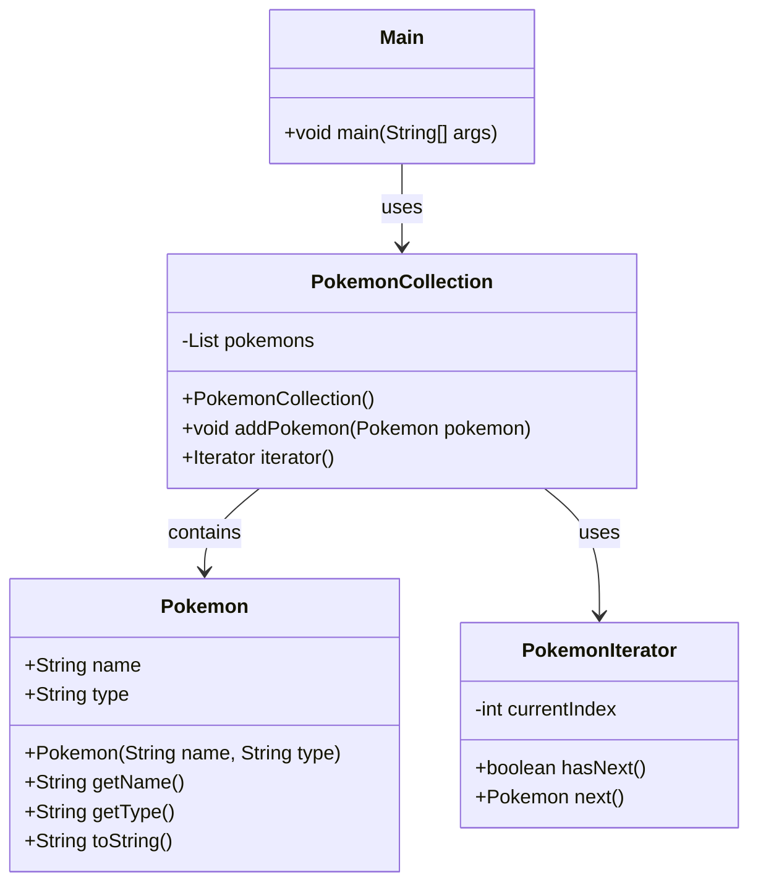

# Iterator


### まとめ

Iterator。反復子。

全体を順番でスキャンしていく処理を行うためのもの
```java
while (iterator.hasNext()) {
    Pokemon pokemon = iterator.next();
    System.out.println(pokemon.getName());
})
```
### メリット
コレクションの内部実装（例えば、リストやセットの具体的なデータ構造）に依存せずに、コレクションの要素にアクセスできます。これにより、データ構造を変更しても、Iteratorを使ったアクセス方法は変わりません。


### Class map
