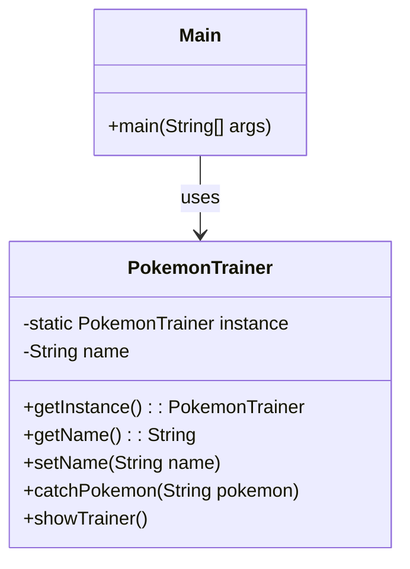

# Singleton

### まとめ

「このクラスのインスタンスはたった１つしか作らないし、作りたくない」

### クラス図

### ChatGPT曰く

Singletonデザインパターンは、あるクラスのインスタンスが常に1つだけであることを保証し、その唯一のインスタンスにアクセスできるようにするためのパターンです。このパターンが必要とされる理由はいくつかあります。

1. リソースの節約

特定のリソース（例えばデータベース接続やファイルシステムへのアクセス）は、高コストであり、複数作成することが非効率的である場合があります。Singletonパターンを使用することで、こうしたリソースを1つのインスタンスで共有し、メモリや処理の無駄を減らすことができます。

2. グローバルアクセスの提供

システム全体で共通の状態や設定を保持するためのクラスが必要な場合、Singletonパターンを使うことで、そのクラスのインスタンスにグローバルにアクセスすることができます。例えば、アプリケーション全体の設定やロギングを行うクラスは、システム全体で1つのインスタンスで十分です。

3. 状態の一貫性

シングルトンにすることで、状態の一貫性を保つことができます。複数のインスタンスが存在すると、それぞれが異なる状態を持つ可能性がありますが、Singletonパターンでは常に同じインスタンスを参照するため、状態が一貫して保たれます。

4. 遅延初期化

Singletonパターンでは、インスタンスが初めて必要になったときに初期化されることが多く、リソースの無駄な消費を防ぐことができます。この「遅延初期化」によって、プログラムの起動時に不要な初期化処理を行わず、効率的にリソースを管理できます